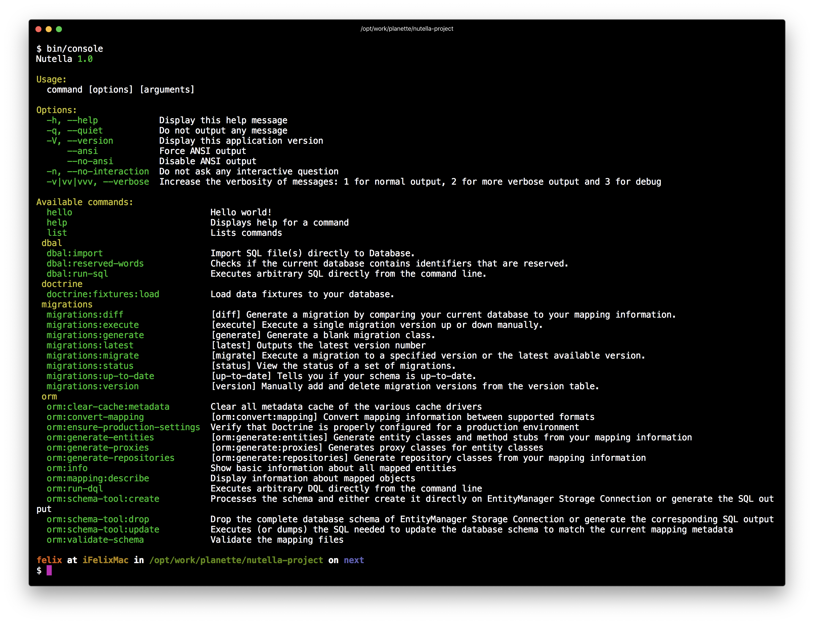

  
  
  
  
  
  

  Website <a href="https://contributte.org">contributte.org</a> | Contact <a href="https://f3l1x.io">f3l1x.io</a> | Twitter <a href="https://twitter.com/contributte">@contributte</a>

## Documentation

For details on how to use this package, check out our [documentation](.docs/README.md).

Please take a note knowledge of PHP, Composer and other tools used is expected and not explained by package docs.

## Versions

| State  | Version      | Branch   | Nette  | PHP     |
|--------|--------------|----------|--------|---------|
| dev    | `^0.9.0`     | `master` | `3.0+` | `>=7.2` |
| stable | `^0.8.0`     | `master` | `3.0+` | `>=7.2` |
| stable | `^0.5.0`     | `master` | `2.4`  | `>=7.1` |
| stable | `^0.4.0`     | `master` | `2.4`  | `>=5.6` |

## Development

See [how to contribute](https://contributte.org/contributing.html) to this package. This package is currently maintained by these authors.

-----

Consider to [support](https://contributte.org/partners.html) **contributte** development team.
Also thank you for using this package.
